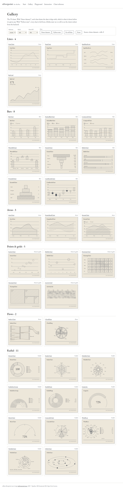
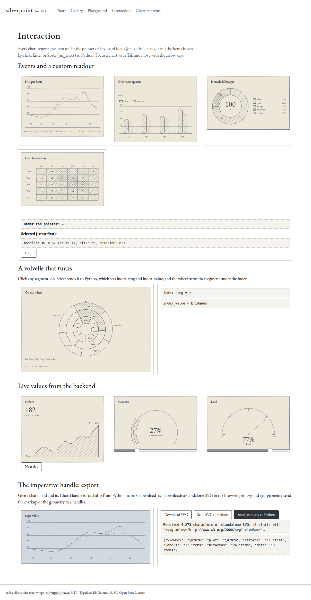

# reflex-silverpoint-react

A [Reflex](https://reflex.dev) custom component for **[silverpoint](https://github.com/ecrespo/silverpoint)**:
charts drawn in the manner of a Renaissance silverpoint drawing, with a fine silver line on a
prepared ground, tone built from hatching, and white heightening on the live value.

The hand-drawn irregularity lives only in the ornament. The data geometry is exact, and every chart
has a `precision` mode that turns the inking off.

It wraps [`@silverpoint/react`](https://www.npmjs.com/package/@silverpoint/react) 0.2.0 and exposes
**all 33 charts**, the **`Dashboard`** (a laid-out, linkable grid of charts), the
`SilverpointProvider`, both grounds (`silverpoint` and `cyanotype`), the interaction events, custom
readouts and the imperative handle (SVG export and geometry) as Python.

### New in 0.2

- **`dashboard`**, **`dashboard_cell`** and **`dashboard_link`**: a titled grid of cards laid out from
  a data-only layout, charts sized to their cells, and charts linked on a datum field.
- **The `cyanotype` ground**: a white line on Prussian blue. Tone is the weight of an exact line, so
  nothing is hatched. Use `ground="cyanotype"` on a chart, the provider or a dashboard.



## Installation

```bash
pip install reflex-silverpoint-react
# or
uv add reflex-silverpoint-react
```

Nothing else to do on the JavaScript side: Reflex installs `@silverpoint/react`,
`@silverpoint/core`, `@silverpoint/grounds` and `@silverpoint/fonts`, and every chart imports the two
stylesheets it needs (`@silverpoint/grounds/styles.css` and the self-hosted EB Garamond of
`@silverpoint/fonts/fonts.css`). No Tailwind, no CDN.

Requires Reflex 0.9.12 or later (React 19).

## Quickstart

```python
import reflex as rx
from reflex_silverpoint_react import line_chart

DATA = [
    {"hour": "00", "hits": 18},
    {"hour": "04", "hits": 11},
    {"hour": "08", "hits": 42},
    {"hour": "12", "hits": 64},
    {"hour": "16", "hits": 57},
    {"hour": "20", "hits": 30},
]


def index() -> rx.Component:
    return rx.box(
        line_chart(data=DATA, x_key="hour", value_key="hits", title="Hits per hour"),
        width="480px",
    )


app = rx.App()
app.add_page(index)
```

The chart takes the width of its container; `height` is the height of the drawing area (160 px by
default). Omit `data` and a chart draws its own demo dataset.

Props are the React props in `snake_case`: `xKey` → `x_key`, `hatchFill` → `hatch_fill`,
`footerRight` → `footer_right`, `centerLabel` → `center_label`, and so on. `data` and every prop can
be a Reflex state var.

## The 33 charts

| Family | Charts |
|---|---|
| Lines | `line_chart`, `step_chart`, `sparkline_rows`, `kpi_card` |
| Bars | `bar_chart`, `stacked_bar_chart`, `composed_chart`, `waterfall_chart`, `funnel_chart`, `bullet_chart`, `pyramid_chart`, `candlestick_chart` |
| Areas | `area_chart`, `range_band_chart`, `stream_chart` |
| Points & grids | `scatter_chart`, `bubble_chart`, `heatmap_chart`, `treemap_chart`, `activity_grid` |
| Flows | `sankey_chart`, `chord_ring` |
| Radial | `donut_chart`, `radar_chart`, `polar_bar_chart`, `radial_arc_group`, `radial_rings`, `gauge_arc`, `meter_chart`, `coxcomb_chart`, `wind_rose`, `volvelle_chart`, `orbit_chart` |

Every factory has a class of the same name in `PascalCase` (`LineChart`, `WindRose`…).
`reflex_silverpoint_react.CHARTS` is the whole catalog with each chart's family and the reference of
its own props (`COMMON_PROPS` holds the shared ones), handy for galleries and documentation.

## Props every chart shares

| Prop | Default | |
|---|---|---|
| `data` | demo dataset | The rows to draw: a list of dicts. Without it, the accessor props (`*_key`, `keys`, `names`) are ignored. |
| `ground` / `substrate` / `mode` | `"silverpoint"` / `"cream"` / `"ink"` | Style. Grounds: `silverpoint` and `cyanotype`. The `silverpoint` substrates are `cream`, `green`, `blue` and `ochre`; `cyanotype` has one, `prussian`, whatever substrate a chart names. `mode="precision"` turns the inking off. |
| `seed`, `id` | derived, stable | The hand drawing is deterministic: same props, same strokes. |
| `height`, `width` | `160`, container width | Size of the drawing area in px. |
| `chrome` | `"card"` | `"bare"` draws only the plot. |
| `title`, `badge`, `value`, `unit`, `footer_left`, `footer_right` | — | The card's text. |
| `label`, `description`, `data_table` | from `title`, —, `"hidden"` | Accessibility. |
| `locale`, `number_format` | environment | Number formatting (`number_format` is a dict of `Intl.NumberFormatOptions`). |
| `hatch_fill` | `"tile"` | `"per-shape"` gives richer hatching at a much greater weight. |
| `tooltip` | built-in readout | A custom readout; see `tooltip_template`. |
| `on_active_change`, `on_select` | — | Events; see below. |

## One ground for the whole app

```python
from reflex_silverpoint_react import bar_chart, donut_chart, silverpoint_provider

silverpoint_provider(
    bar_chart(data=sales, x_key="month", value_key="units", title="Units sold", unit="units"),
    donut_chart(data=channels, name_key="channel", value_key="share", title="Sales by channel", center_label="%"),
    ground="silverpoint",
    substrate="green",
    locale="en-GB",
)
```

A prop on a chart always wins over the provider. The provider's props can be state vars, so one
select can re-ground a whole dashboard.

## Dashboards

`dashboard` lays charts out in a titled grid. The layout is plain data: the number of columns, each
cell's column and row spans (per breakpoint if you like), the row height and the gap. The
breakpoints are the dashboard's own width: `sm` below 640 px, `md` up to 1024 px, and `lg` above.
The defaults are 1, 2 and 4 columns. Each chart is sized to its cell, and `ground`, `substrate`,
`mode` and `locale` pass to every chart inside.

```python
from reflex_silverpoint_react import (
    bar_chart,
    dashboard,
    dashboard_cell,
    dashboard_cell_layout,
    dashboard_layout,
    kpi_card,
    line_chart,
)

dashboard(
    dashboard_cell(kpi_card(title="Revenue", metric="thousands", delta=6.4), cell="revenue"),
    dashboard_cell(line_chart(data=State.ops, x_key="hour", value_key="hits", title="Traffic"), cell="traffic"),
    dashboard_cell(bar_chart(data=State.ops, x_key="hour", value_key="errors", title="Errors"), cell="errors"),
    id="ops",  # required
    title="Operations",  # or label=... for no visible heading
    description="Service health over the last day.",
    layout=dashboard_layout(
        ["revenue", dashboard_cell_layout("traffic", col_span={"md": 2, "lg": 3}, row_span=2), "errors"],
        columns={"sm": 1, "md": 2, "lg": 4},
        row_height=240,
        gap=16,
    ),
    link="hour",  # link the charts on the rows' "hour" field
    on_link_change=State.on_link,  # {"key": "hour", "value": "18"}, or None when it clears
)
```

- `dashboard_cell(chart, cell="id")` puts a chart in a named layout cell. Children without one follow
  the named cells, in source order, with span 1.
- With `link`, pointing at or focusing an item in one chart marks every item in the other charts
  that has the same value in that field. `dashboard_link(..., link="hour")` does the same for charts
  you lay out yourself, outside a dashboard grid.
- `heading_level` (2-6) sets the title's heading level. `ssr_width` is the width the grid is laid
  out for before the browser measures it.
- `dashboard_layout` and `dashboard_cell_layout` write the camelCase keys the component reads. You
  can also pass a plain dict.
- The layout values and the charts' props can be state vars.

## Interaction

```python
class State(rx.State):
    active: str = "—"

    @rx.event
    def on_active(self, item: dict | None):
        self.active = "—" if item is None else f"{item['datum']['hour']}: {item['value']}"

    @rx.event
    def on_select(self, item: dict):
        print("selected", item["datum"])


line_chart(
    data=DATA,
    x_key="hour",
    value_key="hits",
    on_active_change=State.on_active,
    on_select=State.on_select,
    tooltip=tooltip_template("{datum.hour} h · {value} hits"),
)
```

- `on_active_change` receives the item under the pointer or keyboard focus, and `None` when it
  leaves. `on_select` fires on click, `Enter` or `Space`. The item is
  `{"seriesKey", "index", "datum", "value", "point": {"x", "y"}}`.
- `tooltip_template(text)` builds the `tooltip` render function from a format string. Placeholders:
  `{heading}`, `{text}` (the built-in readout's two lines), `{announcement}`, `{value}`, `{index}`,
  `{series}` and `{datum.<field>}`. `{{` and `}}` print literal braces.

## Export: the imperative handle

Give a chart an `id` and its `ChartHandle` is reachable from Python:

```python
from reflex_silverpoint_react import download_svg, get_geometry, get_svg

line_chart(id="hits", data=DATA, x_key="hour", value_key="hits")

rx.button("Download SVG", on_click=download_svg("hits", "hits.svg"))  # in the browser
rx.button("SVG to Python", on_click=get_svg("hits", State.receive_svg))  # handler gets a str
rx.button("Geometry", on_click=get_geometry("hits", State.receive_geometry))  # handler gets a dict
```

The exported SVG carries its own ground colours, so it renders the same outside the app.

## Notes

- `volvelle_chart`: `index_ring` and `index_value` apply to your own rings, so pass `data` when you
  use them (the demo dataset keeps its own index).
- `gauge_arc` and `meter_chart` take `percent` (0-100) instead of `data`.
- Charts switch to `precision` by themselves under `prefers-contrast: more` or
  `forced-colors: active`; no prop overrides that.
- Accessors are field names (strings). The JavaScript API also accepts functions; from Python, shape
  your rows instead.

## Demo app

```bash
uv venv && uv pip install -e .
cd silverpoint_react_demo
uv run reflex run
```

Pages: **Start** (quickstart, provider, ink vs precision), **Gallery** (the 33 charts, ground
controls, demo datasets vs data from Python state with a re-roll), **Playground** (one chart, every
rendering choice and the Python that reproduces it), **Interaction** (events, custom readout, a
volvelle that turns on click, live KPI/gauge/meter, SVG and geometry export), **Dashboard** (a
linked operations dashboard fed from Python state with ground, substrate, mode and column controls, a
KPI strip, and `dashboard_link` on its own) and one **reference page per chart** (`/chart/<slug>`)
with its props. The Gallery and Playground also get a ground control, for `cyanotype`.



## Development

```bash
uv venv && uv pip install -e ".[dev]"
uv run pytest
uv run ruff check .
uv run reflex component build   # .pyi stubs + sdist and wheel in dist/
```

## License

MIT. silverpoint is MIT; the EB Garamond typeface is under the SIL Open Font License.
